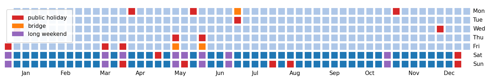

====================
python-long-weekends
====================

A simple python library to spot holiday "bridges" and long weekends.
When a public holiday falls on a Tuesday or a Thursday, 
people typically take Monday or Friday off work to enjoy long vacations.
Italians call those days "ponti" ("bridges").
To the best of my knowledge, there is no English translation for this term 
apart from a generic "long weekend".

This library spots single working days that are preceded
and followed by a weekend and/or a public holiday, and classifies them as "bridges". 
Based on the identified "bridges", this library also labels "long weekends", 
here defined as a series of 3 or more days that are either weekend, 
holidays, or holiday "bridges".

This library is intended to help generate informative features for 
energy consumption prediction models. 

Inspired by https://stackoverflow.com/a/57865434/7059626 (thank you @jezrael).

Example Usage
-------------

.. code-block:: python
    >>> import holidays as holidays_api
    >>> from long_weekends.long_weekends import spot_holiday_bridges

    >>> start = '2021-01-01'
    >>> end = '2021-12-31'
    >>> holidays = holidays_api.CH(prov='TI', years=[2020, 2021, 2022])
    >>> bridges, long_weekends = spot_holiday_bridges(
            start=start, end=end, holidays=holidays)

    >>> bridges
    [Timestamp('2021-05-14 00:00:00'),
     Timestamp('2021-06-04 00:00:00'),
     Timestamp('2021-06-28 00:00:00')]

    >>> long_weekends
    [Timestamp('2021-01-01 00:00:00'),
     Timestamp('2021-01-02 00:00:00'),
     Timestamp('2021-01-03 00:00:00'),
     Timestamp('2021-03-19 00:00:00'),
     Timestamp('2021-03-20 00:00:00'),
     Timestamp('2021-03-21 00:00:00'),
     Timestamp('2021-04-02 00:00:00'),
     Timestamp('2021-04-03 00:00:00'),
     Timestamp('2021-04-04 00:00:00'),
     Timestamp('2021-04-05 00:00:00'),
     Timestamp('2021-05-13 00:00:00'),
     Timestamp('2021-05-14 00:00:00'),
     Timestamp('2021-05-15 00:00:00'),
     Timestamp('2021-05-16 00:00:00'),
     Timestamp('2021-05-22 00:00:00'),
     Timestamp('2021-05-23 00:00:00'),
     Timestamp('2021-05-24 00:00:00'),
     Timestamp('2021-06-03 00:00:00'),
     Timestamp('2021-06-04 00:00:00'),
     Timestamp('2021-06-05 00:00:00'),
     Timestamp('2021-06-06 00:00:00'),
     Timestamp('2021-06-26 00:00:00'),
     Timestamp('2021-06-27 00:00:00'),
     Timestamp('2021-06-28 00:00:00'),
     Timestamp('2021-06-29 00:00:00'),
     Timestamp('2021-10-30 00:00:00'),
     Timestamp('2021-10-31 00:00:00'),
     Timestamp('2021-11-01 00:00:00')]

